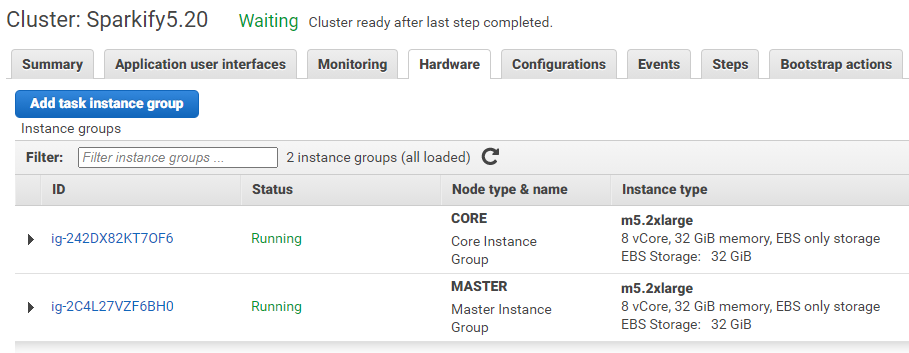
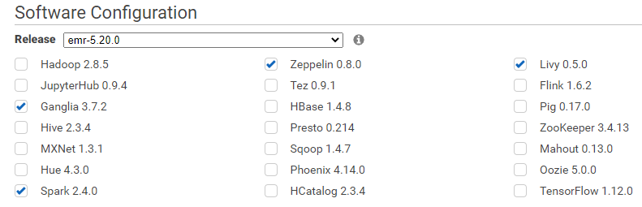

# Churn prediction with Spark and AWS EMR

## Motivation
175 000 000 000 000 GB - this amount of data will be produced by the world population by 2025 according 
to <a href=https://www.seagate.com/files/www-content/our-story/trends/files/idc-seagate-dataage-whitepaper.pdf>IDC research</a>. 
It's equivalent of 175 ZB (Zetta bytes). To give You a better view, currently we produce "only" about 40 ZB. 
Dynamic increase of amount of data brings with it the rapid development of processing technology. 

Data have greater and greater impact on business.

Services like Facebook, Youtube or Spotify generates bilions of records of users activity each day. Most common 
application of this data is to discover and fulfill users needs, and make business more profitable. 
This may be achieved in three basic ways:
- **acquisition** - encourage new users to use the service
- **upsell** - upsell services to current users
- **churn prevention**.

Each way requires specific toolkit and methods to deal with succesfully. Machine learning algorithms are widely used in all of above cases.
**This project presents an example usage of state-of-the-art Big-Data processing framework - Spark -  to predict churn on** ***Sparkify,*** **fictive music streaming company.**
The dataset have been provided by Udacity, as a part of Data Scientist Nanodegree project.
 
Spark is an open-source, distributed processing system used for big data workloads. It's desired for general purpose of big data processing.
It can be used for multiple things like running distributed SQL, creating data pipelines, ingesting data into a database, 
running Machine Learning algorithms, and much more. Spark is available on Java and Scala. There is also a Python API that is used in this project.

The project consists of two notebooks:
* Exploratory Data Analysis and training process performed on a sample of traffic data
* Modelling & Evaluation performed on full dataset (~14Gb) using AWS Elastic Map Reduce cluster.

<p align="center">


 
</p>

# AWS Elastic Map Reduce cluster
The cluster consists of 3 nodes: master node + 2 core. There are 3 x m2.2xlarge instance (8 vCore, 32 GiB memory). 
The EMR software version is `emr-5.20.0`, that includes **Spark 2.4.0**:   
 
 

# Project steps
1. Data understanding
1. Extracting target feature - flagging churn
1. Core Exploratory Data Analysis
1. Feature engineering:
    1. Extracting activity period 
    1. Extracting time-based features
    1. Calculating relative features
1. Modelling
1. Evaluation
1. Conclusions
   

# Problem definition
The project aims to predict whether the user is likely to cancel the service based on the past behaviour data.
The churn event have been extracted from the Sparkify dataset using the service cancellation confirmation done by an user.  
The main challenge related to churn is its **frequency**. Churn is a rare phenomena what leads to unbalanced 
data in terms of number of users who canceled a service or not.


# Data
The sample data as well as the full dataset are available as .json via AWS S3.
Sample dataset consists of 100k traffic records, while the fulldataset - 26 259 199 records.

Below are the available fields
```
 |-- artist: string (nullable = true)
 |-- auth: string (nullable = true)
 |-- firstName: string (nullable = true)
 |-- gender: string (nullable = true)
 |-- itemInSession: long (nullable = true)
 |-- lastName: string (nullable = true)
 |-- length: double (nullable = true)
 |-- level: string (nullable = true)
 |-- location: string (nullable = true)
 |-- method: string (nullable = true)
 |-- page: string (nullable = true)
 |-- registration: long (nullable = true)
 |-- sessionId: long (nullable = true)
 |-- song: string (nullable = true)
 |-- status: long (nullable = true)
 |-- ts: long (nullable = true)
 |-- userAgent: string (nullable = true)
 |-- userId: string (nullable = true)
```

## Hypotheses
Why do users leave the service? What are possible reasons? Well, it's actually quite simple. I would stop using the 
service if the content dont match me or there are tons of bugs. I would use the less and less and one day leave it at all. 
When there weren't any of my friends who used the service, I would take decision to left even sooner because there wouldn't 
be anything what kept me there.

Let's break this into the bullet points - this are the traces that may be related to churn:
1. Decrease in number of played songs during last period vs a period before or overall smaller number of played songs 
than average.
1. How much time does user spend on a platform?
1. Increased number of thumbs down.
1. A little number of added contacts.
1. Unusual number of looking for settings/help page.
1. Occurence of errors
1. From how long a user use a service? New users probably are more likely to cancel the service.

## Modelling
There were 3 ML algorithms tested from Spark ML library: LogisticRegression, RandomForestClassifier and GBTClassifier (Gradient-Boosted Trees).

Final features set:
***C*** - *event count (in last 60 days)*
***CPS*** - *event count per session*

```
 'avgItemsInSession',
 'daysFromReg',
 'isMale',
 'sessCount',
 'About_CPS',
 'About_C',
 'Add Friend_CPS',
 'Add Friend_C',
 'Add to Playlist_CPS',
 'Add to Playlist_C',
 'Downgrade_CPS',
 'Downgrade_C',
 'Error_CPS',
 'Error_C',
 'Help_CPS',
 'Help_C',
 'Logout_CPS',
 'Logout_C',
 'NextSong_CPS',
 'NextSong_C',
 'Roll Advert_CPS',
 'Roll Advert_C',
 'Save Settings_CPS',
 'Save Settings_C',
 'Settings_CPS',
 'Settings_C',
 'Submit Downgrade_CPS',
 'Submit Downgrade_C',
 'Submit Upgrade_CPS',
 'Submit Upgrade_C',
 'Thumbs Down_CPS',
 'Thumbs Down_C',
 'Thumbs Up_CPS',
 'Thumbs Up_C',
 'Upgrade_CPS',
 'Upgrade_C'
```


## Results & conclusions
Best results have been achieved using logistic regression:
Fscore - 0.54
Recall - 0.76
Precision - 0.41
Training process was performed using AWS EMR.
Other methods weren't as effective as logistic regression. Moreover, even Cross Validation with Grid Search didn't improve the results. This may suggest that there should be more work done with feature engineering.

Data require further investigation. There is a lot of topics that should be further explored. Ideas:
* features based on trends (decrease/increase of page views WoW or MoM)
* investigate locations/levels/userAgents
* investigate false-negatives
